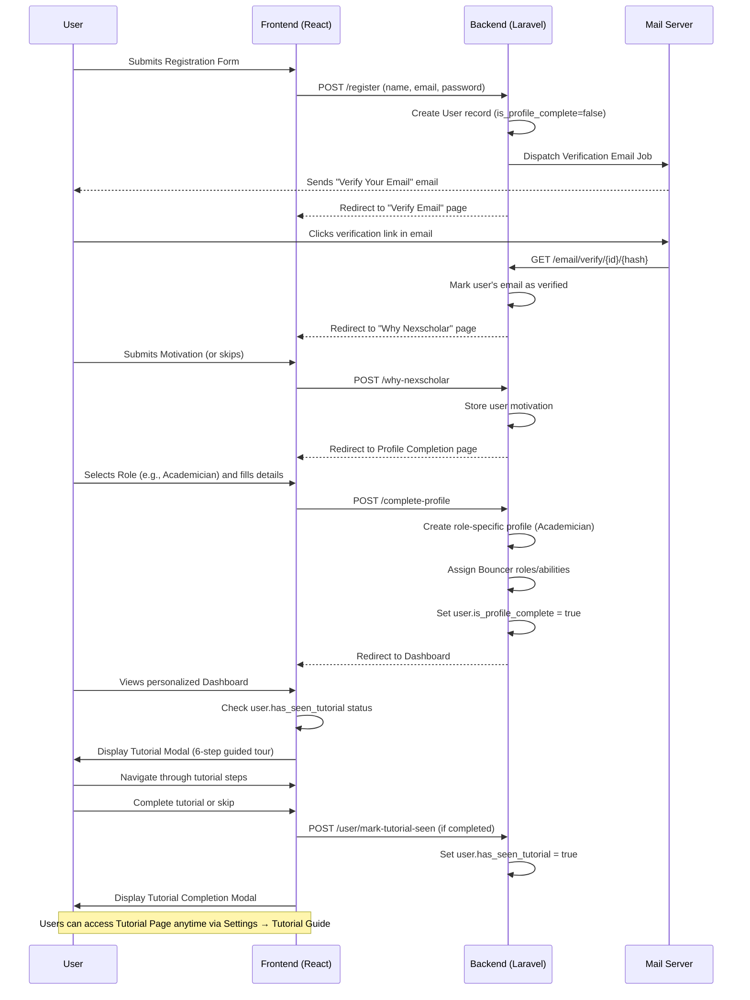
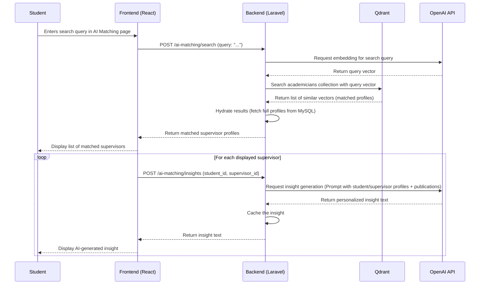
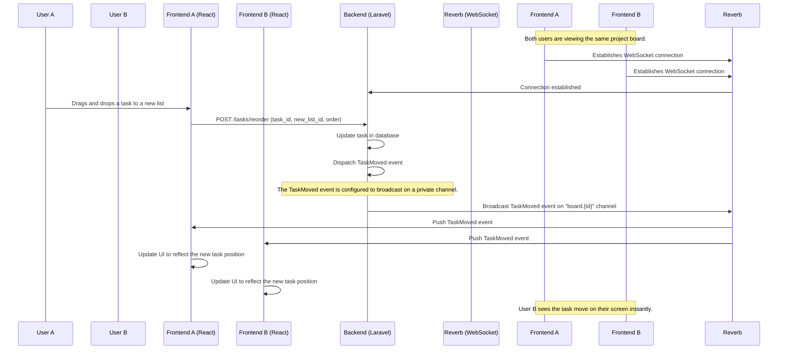
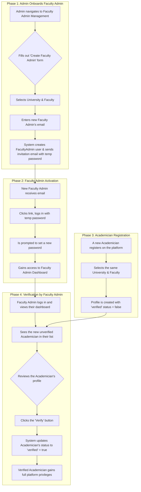
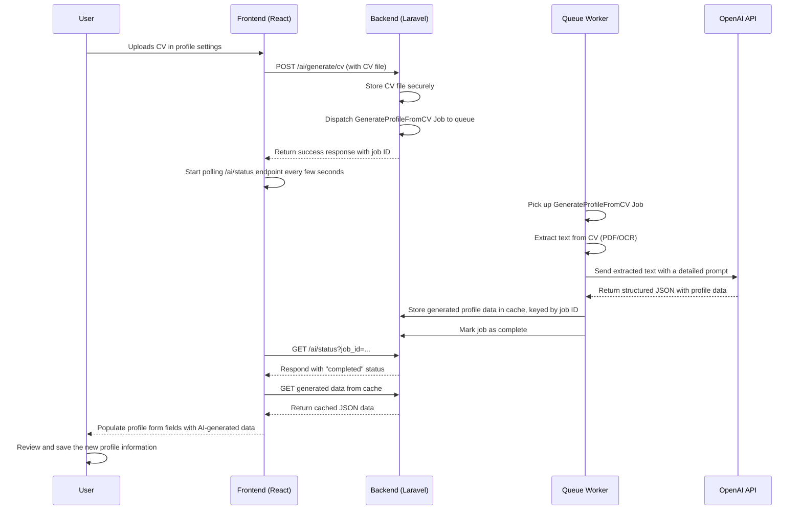

# Nexscholar Key User Workflows

This document illustrates the primary end-to-end user journeys and workflows within the Nexscholar platform. It uses diagrams to clarify the sequence of events and interactions between the user, the frontend, the backend, and external services.

## Table of Contents

- [1. New User Onboarding Workflow](#1-new-user-onboarding-workflow)
- [2. AI-Powered Supervisor Search Workflow](#2-ai-powered-supervisor-search-workflow)
- [3. NexLab (ProjectHub): Task Creation and Real-Time Update Workflow](#3-nexlab-projecthub-task-creation-and-real-time-update-workflow)
- [4. Faculty Admin: Academician Verification Workflow](#4-faculty-admin-academician-verification-workflow)
- [5. AI Profile Generation from CV Workflow](#5-ai-profile-generation-from-cv-workflow)
- [6. Messaging: Real-Time Conversation & Sidebar Update Workflow](#6-messaging-real-time-conversation-sidebar-update-workflow)

---

## 1. New User Onboarding Workflow

This workflow describes the journey of a new user from initial registration to accessing their dashboard.



## 2. AI-Powered Supervisor Search Workflow

This diagram shows how a student finds a supervisor using the semantic search and AI matching features.



## 3. NexLab (ProjectHub): Task Creation and Real-Time Update Workflow

This workflow demonstrates the real-time collaboration feature in NexLab, showing how an action by one user is instantly reflected for another.



## 4. Faculty Admin: Academician Verification Workflow

This flow shows how a platform Admin onboards a Faculty Admin, who then verifies a new Academician.



## 5. AI Profile Generation from CV Workflow

This workflow details the asynchronous process of generating a user's profile from an uploaded CV.



## 6. Messaging: Real-Time Conversation & Sidebar Update Workflow

This workflow shows how a new message triggers real-time updates in both the active conversation thread for all participants and the conversation list sidebar for the receiver.

```mermaid
sequenceDiagram
    participant Sender
    participant Receiver
    participant Frontend Sender (React)
    participant Frontend Receiver (React)
    participant Backend (Laravel)
    participant Pusher (WebSocket)

    Note over Frontend Sender, Frontend Receiver: Both users are authenticated.
    Frontend Sender ->> Pusher: Subscribes to "conversation.{id}" and "App.Models.User.{senderId}"
    Frontend Receiver ->> Pusher: Subscribes to "conversation.{id}" and "App.Models.User.{receiverId}"

    Sender->>Frontend Sender (React): Types and sends a new message
    Frontend Sender (React)->>Backend (Laravel): POST /api/v1/app/messaging/messages (body, conversation_id)

    Backend (Laravel)->>Backend (Laravel): 1. Persist Message in DB
    Backend (Laravel)->>Backend (Laravel): 2. Update conversation's last_message_id
    Backend (Laravel)->>Backend (Laravel): 3. Dispatch MessageSent event
    Backend (Laravel)->>Backend (Laravel): 4. Dispatch ConversationListDelta event

    subgraph Broadcasting Path 1: Update Active Thread
        Backend (Laravel)->>Pusher: Broadcast MessageSent on "conversation.{id}" channel
        Pusher-->>Frontend Sender (React): Push MessageSent event
        Pusher-->>Frontend Receiver (React): Push MessageSent event
        Frontend Sender (React)->>Sender: Optimistically adds message to thread
        Frontend Receiver (React)->>Receiver: Adds new message bubble to thread
    end

    subgraph Broadcasting Path 2: Update Sidebars
        Backend (Laravel)->>Pusher: Broadcast ConversationListDelta on "App.Models.User.{receiverId}" channel
        Pusher-->>Frontend Receiver (React): Push ConversationListDelta event
        Frontend Receiver (React)->>Receiver: Updates conversation list item with new preview, timestamp, and unread badge
    end

    Note over Backend (Laravel): The ConversationListDelta event is NOT sent to the sender's user channel to avoid duplicate updates.
